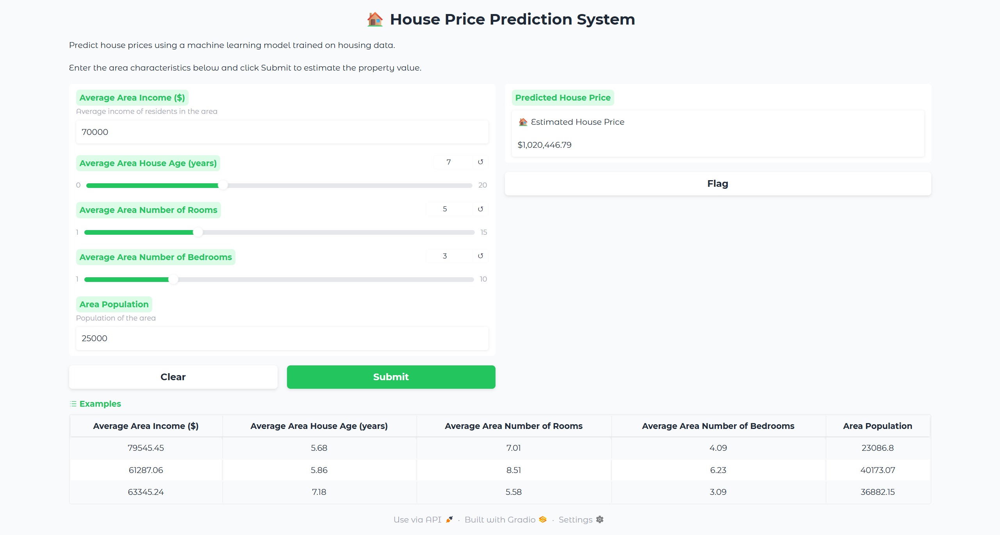

## 🏠 House Price Prediction using Machine Learning

#### Project Overview: 

This project develops a machine learning model to predict house prices based on area-level characteristics such as income, house age, number of rooms, number of bedrooms, and population.

#### The project includes:

1. Exploratory Data Analysis (EDA)
2. Feature selection
3. Model training and evaluation
4. Hyperparameter experimentation
5. Model comparison
6. Deployment using Gradio

## Dataset

#### Dataset Features

| Feature | Description |
|----------|-------------|
| **Avg. Area Income** | Average income of residents in the area |
| **Avg. Area House Age** | Average age of houses in the area |
| **Avg. Area Number of Rooms** | Average number of rooms in houses |
| **Avg. Area Number of Bedrooms** | Average number of bedrooms in houses |
| **Area Population** | Population of the area |
| **Price** | Target variable representing house price |
| **Address** | House address (excluded from modeling) |

## Dataset Summary:
- Total Records: 5,000
- Missing Values: None
- Target Variable: Price

## Exploratory Data Analysis (EDA)
#### Key Findings
- Most numerical features follow approximately normal distributions.
- House prices are relatively normally distributed.
- A small number of outliers exist but do not significantly affect the dataset.
- Average Area Income has the strongest correlation with house price.
- All selected features show positive relationships with the target variable.

## Model Comparison

| Rank | Model | Train R² | Test R² | Test MSE |
|------|--------|----------|----------|-----------|
| 1 | **Lasso α=1** | 0.917979 | **0.917997** | 10,088,999,283 |
| 2 | Ridge α=1 | 0.917979 | 0.917997 | 10,089,003,189 |
| 3 | Lasso α=0.1 | 0.917979 | 0.917997 | 10,089,007,632 |
| 4 | Ridge α=0.1 | 0.917979 | 0.917997 | 10,089,007,982 |
| 5 | Lasso α=0.01 | 0.917979 | 0.917997 | 10,089,009,199 |
| 6 | Linear Regression | 0.917979 | 0.917997 | 10,089,009,301 |
| 7 | Ridge α=10 | 0.917972 | 0.917992 | 10,089,652,364 |
| 8 | Polynomial Degree 2 | 0.918147 | 0.917914 | 10,099,268,149 |
| 9 | Ridge α=100 | 0.917380 | 0.917403 | 10,162,063,037 |
| 10 | Polynomial Degree 3 | 0.918909 | 0.917397 | 10,162,847,726 |
| 11 | KNN k=7 | 0.905025 | 0.870490 | 15,933,872,685 |
| 12 | KNN k=5 | 0.910855 | 0.869317 | 16,078,241,761 |
| 13 | KNN k=3 | 0.928026 | 0.850692 | 18,369,704,996 |


## 🏆 Best Model

After evaluating multiple machine learning algorithms, **Lasso Regression (α = 1)** was selected as the best-performing model based on the highest **Test R² score**.<br>

| Metric | Value |
|---------|---------|
| **Model** | Lasso Regression (α = 1) |
| **Test R²** | **0.917997** |
| **Test MSE** | **10,088,999,283.03** |

## Project Structure

```text
House-Price-Prediction/
│
├── data/
│   └── USA_Housing.csv
│
├── notebooks/
│   ├── 1_EDA.ipynb
│   └── 2_Training.ipynb
│
├── models/
│   └── best_model.pkl
│
├── screenshots/
│   └── gradio_interface.png
│
├── app.py
├── requirements.txt
└── README.md
```


## Gradio Web Application

The project includes a Gradio interface where users can:<br>

- Enter house characteristics
- Predict house prices instantly
- Explore example house configurations
#### Input Features
- Average Area Income
- Average House Age
- Average Number of Rooms
- Average Number of Bedrooms
- Area Population
#### Output
- Predicted House Price

## 📸 Screenshots

#### Gradio Interface




## Installation

#### Clone the repository:
git clone https://github.com/rotoncsedu/house-price-prediction.git <br>
cd house-price-prediction

#### Install dependencies:

pip install -r requirements.txt

## Run the Application

python app.py<br>

Or launch the Gradio interface:<br>

interface.launch(share=True)

## Technologies Used
- Python
- Pandas , NumPy , Matplotlib , Seaborn
- Scikit - learn
- Gradio

## 👨‍💻 Author

Md. Al-Imran Roton

Programmer, Begum Rokeya University, Rangpur

Machine Learning & AI Enthusiast